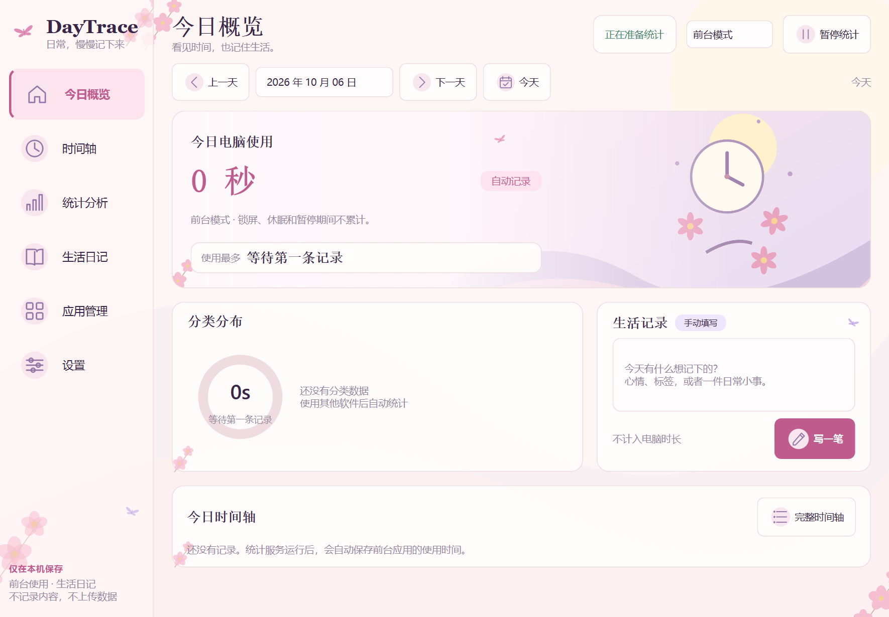

# DayTrace

DayTrace 是 Windows 上的本地使用时间记录工具，也能保存每天的生活日记。程序只统计前台应用，不需要账户或服务器。



## 功能

- 前台模式持续统计当前应用；活跃模式在键盘、鼠标空闲超过阈值后暂停。默认阈值为 5 分钟。
- 今日概览、时间轴、应用和分类统计、历史日历。
- 生活日记、心情、标签和自动保存。
- 应用分类、排除列表、浅色和深色主题、提醒与开机启动。
- CSV/JSON 导出、SQLite 备份与恢复。
- 系统托盘和单实例运行，隐藏窗口后继续统计。

两个模式都只统计前台应用。后台应用、多开窗口不会重复累计；锁屏、休眠、会话断开和手动暂停期间不计时。手动日记不增加电脑使用总时长。

## 从源码运行

需要 Windows 10/11 64 位和 Python 3.12 或更高版本。本提交包在 Python 3.13 上验证。

下载仓库 ZIP 并解压，或克隆仓库。在项目根目录打开 PowerShell，执行：

```powershell
py -3.13 -m venv .venv
.\.venv\Scripts\python.exe -m pip install -r requirements-dev.txt
.\.venv\Scripts\python.exe run_daytrace.py
```

使用其他受支持的 Python 版本时，调整第一行的版本参数。环境创建完成后，也可双击 `运行源码.cmd`。

首次打开时没有历史数据。使用电脑约半分钟，再打开窗口查看记录。右上角关闭按钮会隐藏窗口；从托盘选择“完全退出”才会停止统计。

## 测试与打包

```powershell
.\.venv\Scripts\python.exe -m pytest -q
powershell -ExecutionPolicy Bypass -File .\scripts\build.ps1
```

打包结果在 `dist\DayTrace`。分发时需要保留 EXE 和整个 `_internal` 文件夹，接收者无需安装 Python。

生成附带源码、说明和第三方许可的交付目录：

```powershell
.\.venv\Scripts\python.exe scripts\package_release.py --destination dist\DayTrace-release
```

目标目录必须尚不存在。发布前压缩整个交付目录，再将 ZIP 上传到 GitHub Releases。不要把 EXE 和依赖目录提交到源码仓库。

原创图形的 SVG 源文件、PNG 及生成脚本均已包含。重新生成素材：

```powershell
.\.venv\Scripts\python.exe scripts\make_open_art.py
```

## 数据与隐私

默认数据目录为 `%LOCALAPPDATA%\DayTrace`。其中包含 `daytrace.sqlite3`、运行日志和用户图标。启动时设置 `DAYTRACE_DATA_DIR` 可以使用独立目录，适合测试。

程序记录应用名称、程序路径、使用区间、设置和主动填写的日记，不读取窗口标题、网址、聊天内容、输入内容或屏幕截图。应用运行不连接远程服务；安装依赖需要联网。Qt 的本地 socket 仅用于单实例通信。

CSV、JSON 和数据库备份可能包含个人记录，分享前请检查。`.gitignore` 已排除数据库、日志、缓存和构建产物；它不能识别任意命名的 CSV/JSON 导出文件，请勿将自己的导出记录放进仓库。

恢复数据库前会备份现有记录。数据库备份不包含用户自定义图标图片，换电脑后可能需要重新选择图标。

## 精度与验证范围

程序每 1 或 2 秒采样一次，应用切换边界存在采样误差。超过 6 秒的采样间隔、明显调时及无法确定归属的区间会被舍弃，因此可能少计。意外退出可能丢失最近一次尚未提交的记录，默认保存间隔为 30 秒。

本项目适合回顾日常使用。真实锁屏、休眠、全屏游戏、权限受限进程以及其他电脑上的运行情况，需要按环境验收。当前版本已执行的检查见[验证报告](docs/验证报告.md)，人工检查步骤见[Windows 运行与验收](docs/Windows运行与验收.md)。

## 目录

| 路径 | 内容 |
| --- | --- |
| `daytrace/` | 应用、统计核心、Windows 平台层和 Qt 界面 |
| `tests/` | 自动化测试 |
| `scripts/` | 素材生成、打包和验收脚本 |
| `assets/` | 原创图标与界面图形 |
| `docs/` | 核心说明、运行指南、验证报告和预览 |
| `third_party_licenses/` | 第三方许可原文与来源清单 |

核心规则见[统计核心说明](docs/CORE_NOTES.md)，提交修改前请阅读[贡献说明](CONTRIBUTING.md)。

## 许可证

DayTrace 自身代码、文档及本仓库的原创界面素材采用 [MIT 许可证](LICENSE)，允许修改、商用和再分发，并要求保留版权及许可声明。

第三方库采用各自的许可证，MIT 不替代这些条款。PySide6、Shiboken6 和所用 Qt 组件按 LGPL v3 使用；二进制分发说明及对应源码地址见[第三方声明](THIRD_PARTY_NOTICES.md)。

本仓库提供原创抽象背景和功能图标；素材的生成方法见[素材说明](assets/art/SOURCES.md)。
